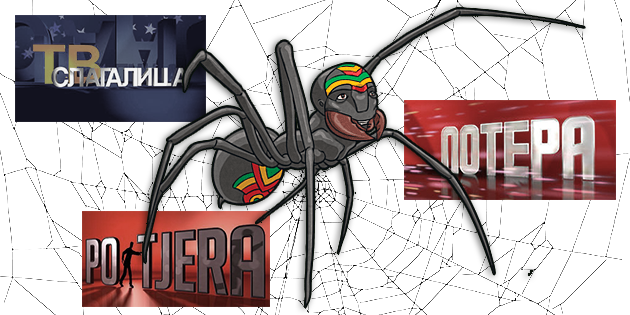

# Anansi Extract

  

**Anansi 1.0-a** (`anansi-extract`) is a Python-based tool for extracting quiz content from video recordings of popular TV game shows, with an initial focus on broadcasts in the Balkan region.

This repository is a fork of the original **[Anansi](https://github.com/ilic5000/pabkvizgenerator)** project by *Nenad Ilić*, and aims to enhance **modularity** and **accuracy**, with potential gains in **processing performance** as development progresses. It serves as a foundation for continued development, including broader support for additional quiz formats and potential expansion to English-language content.

The system leverages **computer vision** (OpenCV and FFmpeg) and **optical character recognition (OCR)** technologies (EasyOCR and Tesseract) to detect, extract, and structure quiz questions and correct answers directly from video frames.

Anansi 1.0-a is intended for **educational and research purposes**, offering a flexible framework for parsing structured trivia content from unstructured media.

## Quick Start

## 🕸️ Why "Anansi"?

The name is inspired by *[Anansi](https://en.wikipedia.org/wiki/Anansi)*, the clever spider from West African folklore known for his wit, storytelling, and cunning ability to outsmart others. Like its namesake, this tool "crawls" through video data to uncover hidden knowledge — in this case, quiz questions and answers.

---

## ⚠️ Disclaimer

This tool is provided for **educational and research use only**. It is not affiliated with, endorsed by, or authorised by any television networks, game show producers, or content owners.

---
## Documentation

For detailed documentation, including:
- Algorithm explanations
- Installation guide
- Usage examples
- Known issues
- Future roadmap

please visit the [documentation](./docs/README.md).

### License

This project is licensed under the MIT Licence. See the [LICENCE](./LICENSE.md) file for details.
