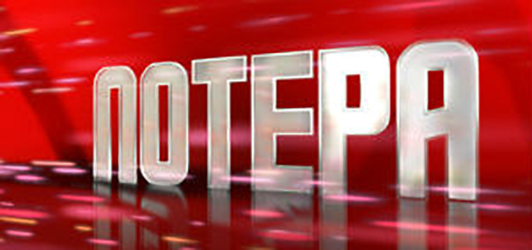
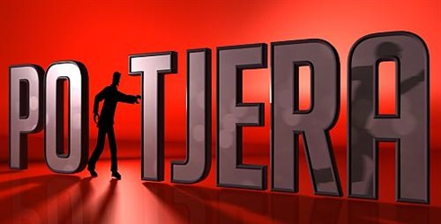
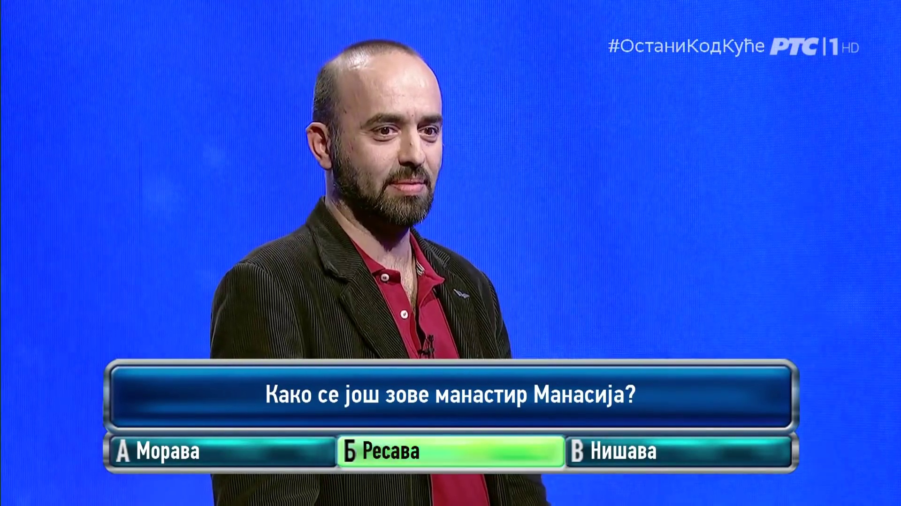
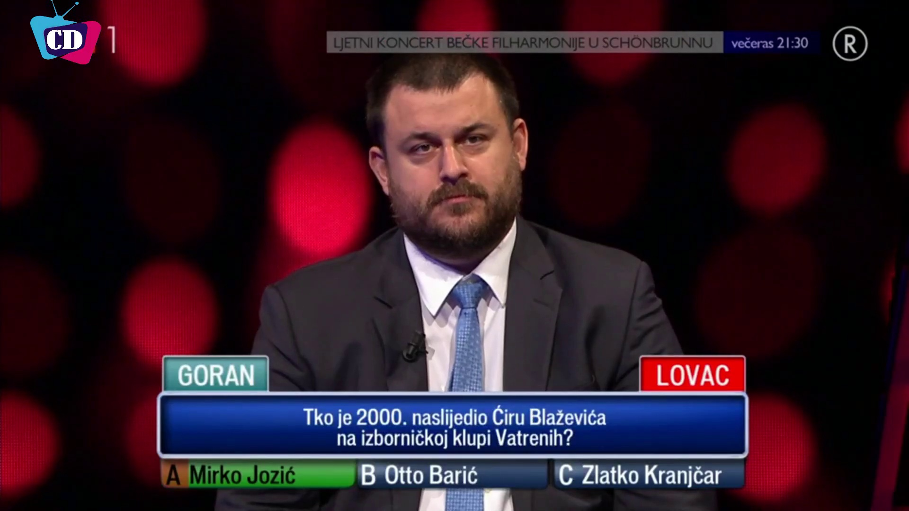
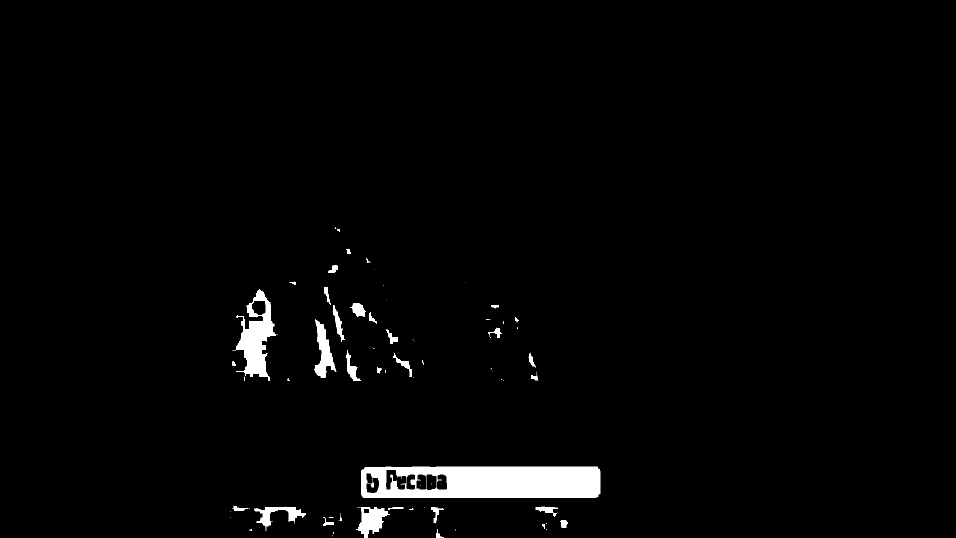
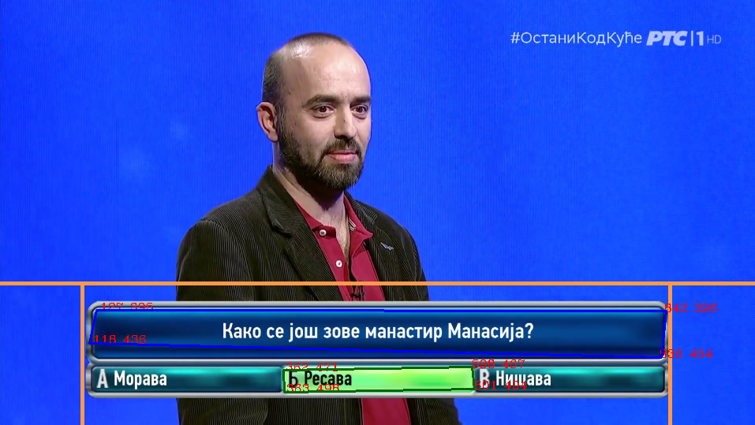
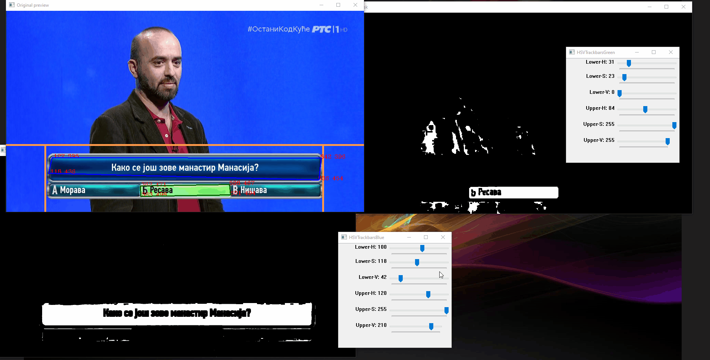
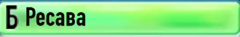

# Pot(j)era Algorithm

## Pot(j)era TV game show

<p align="center">
 
</p>

* https://sr.m.wikipedia.org/sr-el/Potera
* https://hr.wikipedia.org/wiki/Potjera_(kviz)
* https://en.wikipedia.org/wiki/The_Chase_(British_game_show)

## Pot(j)era pseudo algorithm
Here is the basic idea of the Potera and Potjera crawler algorithm. 

1. Open the video file
2. Create seek area in the bottom half of every frame
3. Up until the end of the file do:
    1. Using a green mask find the green rectangle where the answer is
    2. If a green rectangle is found:
        1. Search if the big blue rectangle above is also visible
        2. If the blue rectangle is visible:
            1. OCR the green and blue rectangles
            2. Skip 5sec (where the green rectangle is not visible anymore)
4. Finish processing the video

In the next sections, I will go through every step to explain the reasoning behind it and discuss the current implementation.

## Pot(j)era detailed algorithm 

### Rules of the game

In both the Serbian and Croatian TV game shows, for every player (total of 4 players per show) there are 3 possible (if a player wins the second game, then the third game becomes available) games to play. The first and the third are done verbally and there are no visuals/graphics that show questions on the screen. However, in the second game, players are presented with a question and the possible answers. 

### Finding the green box with the correct answer

In order to find the first question of the game, we need to find the graphics with a question and possible answers in textboxes. After the correct answer is revealed, one of the possible answers, the one which was the correct one, will become green (with green background in the textbox). 

If we look at a typical frame where the questions/answers are clearly visible, we can see that they look pretty much the same in both versions of the game show.

Potera:

<p align="center">

</p>

Potjera:

<p align="center">

</p>

This means that for both versions of the show, we can use the same logic.

In order to find the green box, we can use the same logic as for finding the blue box in the "Slagalica" game - create a green mask, find all the contours/shapes, approximate the shapes and find the largest one. If the area of that shape is larger than some kind of threshold, then, we have found the green textbox. 

To avoid false positives, we can then apply the same logic, but this time with the blue mask, to find, in the same frame, the large rectangle with the question. 

Consider this frame:

<p align="center">

</p>

If we apply a green mask (the range of the green was a trial and error process) we, get something like this:

<p align="center">

</p>

blue mask:

<p align="center">

</p>

and here are contours/shapes found in the green/blue masks. Please notice the orange seek area limits - by using these limits, we can discard all the points (red x,y coordinates) of the shapes that do not belong inside

<p align="center">

</p>

If both the green rectangle and the big blue one are visible in the same frame, and they are both located in the seek area (where we expect the question/answer to appear), then we can continue with the text extraction/OCR.

But before the OCRing section, here is a recording of the simple tool that I created for finding good HSV values for the blue and green masks.

<p align="center">

</p>

### OCR processing of the frames with question and answers

Creating images from the frame is now pretty straightforward. 

In "Slagalica" tesseract was used, but here I tried something else - EasyOCR. This is one of the few open source solutions for OCR that is not based on tesseract. So, naturally, I wanted to try it.

For tesseract, manual preprocessing of the images is needed, however, EasyOCR does all of this automatically, which is pretty cool. 


Original frame:

<p align="center">

</p>

Question:

<p align="center">

</p>

EasyOCR: `Како се још зове манастир Манасија?`

Answer:

<p align="center">

</p>

EasyOCR: `Б Ресава`


We can also try tesseract, instead of EasyOCR, but honestly, there is no need. EasyOCR has proven to be really good for Potera OCR.

## Potera crawler example run

<p align="center">

</p>


```
Question: Како се још зове манастир Манасија?
Answer: Б Ресава
``` 