# Slagalica Algorithm

## Slagalica pseudo algorithm
Here is the basic idea of the Slagalica crawler algorithm. 

1. Open the video file
2. Skip the first half of the video
3. If game start is not found
    1. Go through frames until the template for the game start is found
4. If game start is found
    1. In the seek question area look for the blue mask and the blue rectangle
    2. If the question rectangle is found
        1. Monitor for changes in the answer rectangle
        2. Keep track of the changes
        3. If a change occurred in the answer rectangle
            1. Preprocess the question & answer
            2. OCR 
            3. Sanitization
5. If the number of found questions is 10 or game end is found or the video file has no more frames
    1. Finish processing

In the next sections, I will go through every step to explain the reasoning behind it and discuss the current implementation.

## Slagalica TV game show

<p align="center">

</p>

* [https://sr.m.wikipedia.org/sr-ec/TV_slagalica](https://sr.m.wikipedia.org/sr-ec/TV_slagalica)

## Slagalica detailed algorithm 

### Rules of the game

In the TV game show called "Slagalica", there is a game near the end with the name "Ko zna zna", in which players are giving answers to 10 general knowledge questions. This is, I think, by far, the most liked game in the show. 

### Finding the beginning and the end of the game

The "Ko zna zna" game begins usually in the last third of the show. So we can immediately skip the first half of the video. Then we need to figure out how to find the game start. 

#### After 106th season
Starting from the 106th season (starting from `4.5.2018`), the game intro for the "Ko zna zna" is played on the full screen just before the game. 

Game intro:

<p align="center">
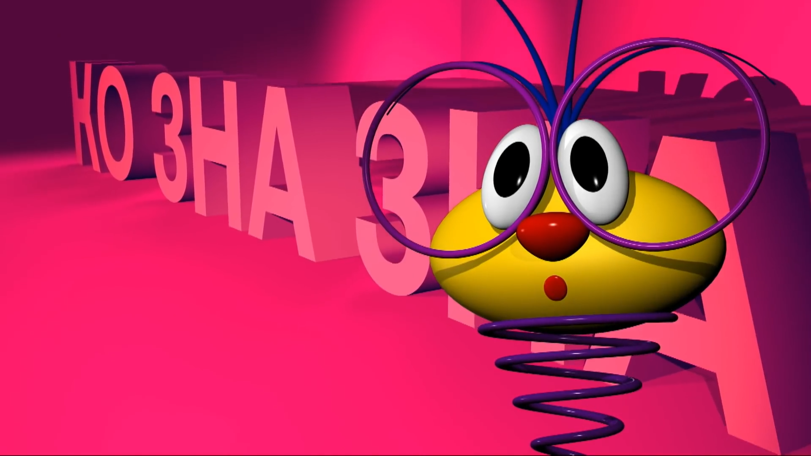
</p>

The easy thing to do was to create a template (smaller image based on the full-frame) to match:

<p align="center">
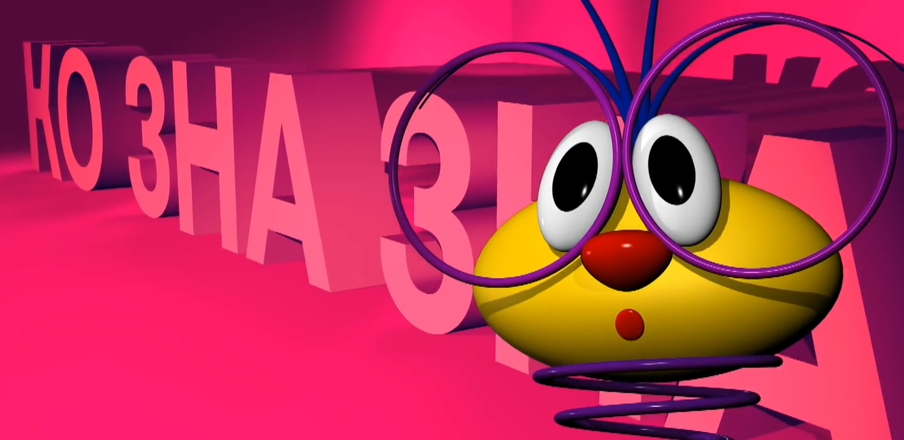
</p>


Using OpenCV you can try to find a template in the image, and the OpenCV will return the confidence level, i.e. how similar are both of the images. By using some kind of threshold (e.g. if the similarity is above `0.5`), it is trivial to find the game start with this logic.

To save the processing time, the next game (the game after "Ko zna zna") intro should also be found and be used as a game end. Sure, you can have a condition if 10 questions are found to end immediately, but sometimes, not all 10 questions will be found (sometimes TV show editor cuts to the next game before showing the last question (e.g. episode from `14.11.2018`).

Using the same logic as for the game intro, you can find the game outro (game end). And as you know, one game end is for another game the beginning - :O mindblown.gif. :) 

So, by using this reference game intro (the game after the main one):

<p align="center">
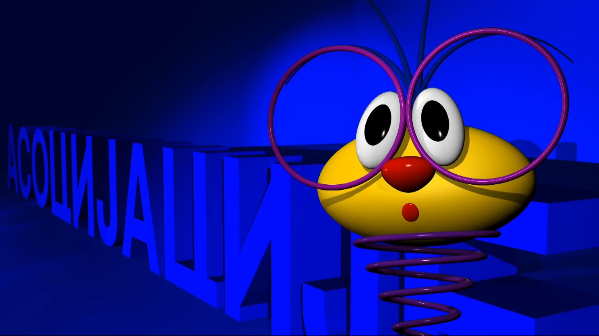
</p>

and with the template:

<p align="center">
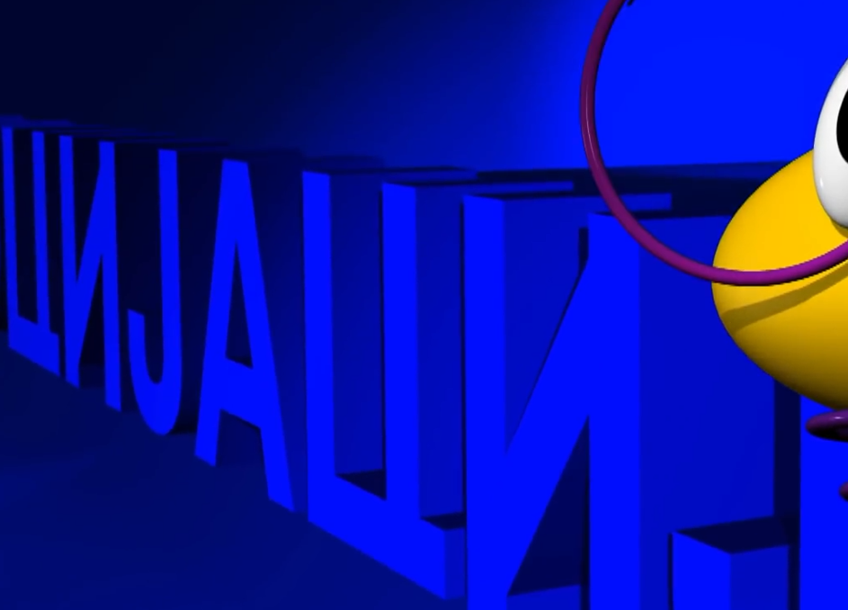
</p>

You can find the next game intro, which is surely the previous game's end.

#### Before 106th season 
Before the 106th season (before `4.5.2018`) the game intro was played on the big screen behind the TV show hosts. So this straightforward way of matching templates cannot work just as well as before the 106th season episodes. 

However we can re-use the same logic [that is being used for Potera](./algorithm_potera.md#finding-the-green-box-with-the-correct-answer) (instead of template matching, use pink mask + contour area matching). 

<p align="center">
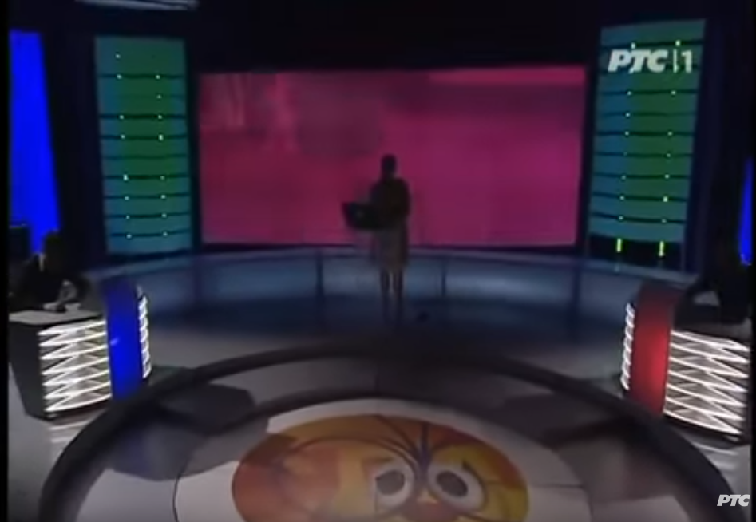
</p>


### Finding the frame with the question
Now that we have the game start frame, we need to find the very first frame after that where the question rectangle is visible. Traditionally, the game has a rectangle-shaped area where questions and answers are shown.

The frame showing this area with question and answer:

<p align="center">
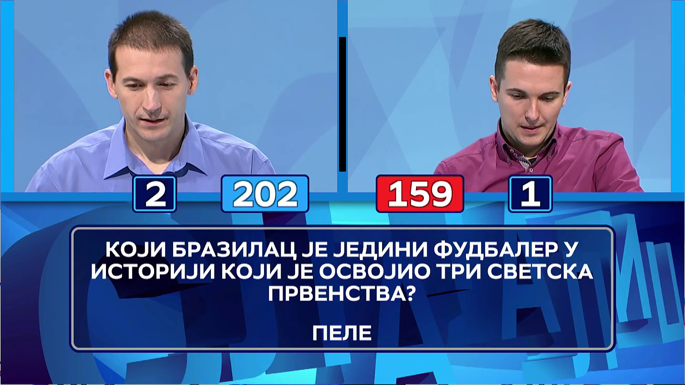
</p>

And if we know that this area is always in the same place, and with the same dimensions/proportions, always at the bottom of the frame, we can filter out the rest of the frame, and use only this section for easier processing. We can split it to answer and questions parts. 

By creating a filtered-out area, we have created our "seek area", and the borders for this area are marked in the image below:

<p align="center">
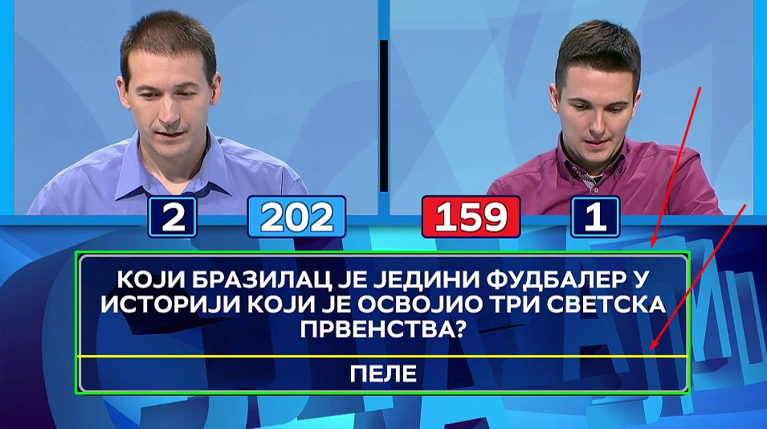
</p>

And if we use the percentage of the image height and width, then, the borders will be scalable and work with any resolution of the same proportions (e.g. 720p and 1080p).

Now that we have a seek area, we need to somehow find the frame with the question rectangle. Remember, up until now we have found only the game beginning, and after that, we need to check future frames when will the question appear in the rectangle. 

Usually, a TV game show host is having a little bit of pre-game monologue, so the question is not immediately presented. Also, during the game, the TV show director can cut to some random shot in the studio, losing the question frame from the screen. So, we need a reliable way to find the frame with the question rectangle.

How this rectangle looks from the start of the game (when we match the template) up until the question rectangle first frame:

<p align="center">

</p>

If you watch closely, you can see that the seek area has a dominant blue color when the desired frame is visible. If there is some sort of dominant color, we can create a mask that will match only certain shades of blue.

Original rectangle:

<p align="center">

</p>

if we apply the blue mask and transform it to grayscale (black and white), we get:

<p align="center">
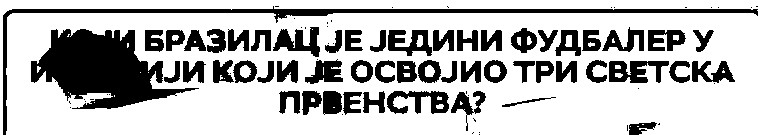
</p>

As you can see, all of the desired blue shade in the image is white. And the image does not have the logo in the background of the question, which helps us a lot with the thing we will try to do next.

The Blue mask image is good and all, however, what can we do with that info? Well, by looking at the blue rectangle question image, if you are familiar with computer vision, the logical thing to do is to try to form a rectangle in this image. And we can do this by trying to find all of the contours (shapes) in this image. As you can expect, there will be a lot of shapes, however, we can approximate the shapes (make them with fewer points, thus making them simpler). By doing this, we can get simple shapes such as squares, rectangles, etc.

Example of approximation of the shapes (original image, approximation, and direct contour/shape)

<p align="center">

</p>

Now, if we try to find contour, then do the approximation on our blue mask image, we get something like (red line closed shape):

<p align="center">
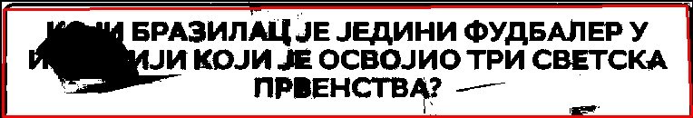
</p>

We have something that looks like a rectangle and remember, this rectangle is based on the blue mask in the section where the question should appear. To trigger the condition that the question is visible, we need to have some kind of threshold (e.g. if the shape is taking up 70% of the image) for the area of this found shape, and if it goes above it, then the question frame is visible. The area threshold should not be hard-coded, but the percentage of the total area of pixels, to be scalable for different resolutions.

When the very first question frame has been found, the answer will not be visible.

The question area will be:

<p align="center">

</p>


The answer area will be:

<p align="center">
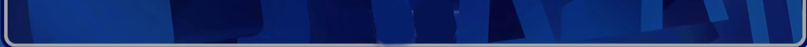
</p>

Answer text is indeed missing, but the important thing is that we now have the beginning of the game when a question is visible. The other important thing is that we know (based on game rules and analyzing the videos) that the answer area rectangle will have the following pattern:

1. empty
2. answer
3. empty
4. answer
5. empty
6. and so on...

So, now we need a way to make a distinction between a rectangle with the answer and one without it.

<p align="center">
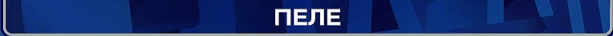
</p>

vs

<p align="center">

</p>

You probably noticed that the one with the answer has a big white text. So, what can we do about it?

Well, we can create a mask again for the blue color, then invert colors, or something like that, but probably the easiest thing is to convert the image to grayscale, and then using threshold, for example, all pixels above 240 value, should remain on the image. If you get the threshold just right, you will get only the white pixels on the image. 
And if you do this on the frame without an answer, you will get an empty image (with no white pixels). 


with answer:

<p align="center">

</p>
<p align="center">

</p>

without answer: 

<p align="center">

</p>
<p align="center">

</p>


And now if we count the white pixels in images, and if we choose some kind of threshold (e.g. "400" pixels), we can compare two successive frames and figure out if there was a significant change in the frames. If change exists, that means that either answer or empty is now visible. And if we keep track of these changes, we can easily figure out when there is a question and when is an empty image (keep in mind that we need to process each question separately).

### OCR processing of the frames with question and answers

Now for the fun part :) 

We've successfully figured out a way to find all questions and answers, but now we need to extract the questions in some kind of text document for easier processing later on. There are many different OCR solutions out there, that are using trained neural net models for recognizing the content. EasyOCR is easy to use, however, even though I used it in Pot(j)era (spoiler alert), Cyrillic letters in the font used on Slagalica are returning really bad results. So, for OCR, I am using the one that actually recognizes this font, and probably the most famous out there - `tesseract`. However, I am using a python wrapper called `pytesseract` for easier and simpler usage. 

During my experiments, I've found that tesseract works a lot better if you preprocess the images and prepare them for OCR. For example, convert them to grayscale, remove noise, apply erode (thin the objects a little bit, etc.). You can find the techniques I did before using OCR in the source code. It was a trial and error process, I guess that the preprocessing that I did will not work universally, but in these narrow and expected test cases, it worked flawlessly.

Preprocess examples:

<p align="center">

</p>

<p align="center">

</p>

Question:

<p align="center">
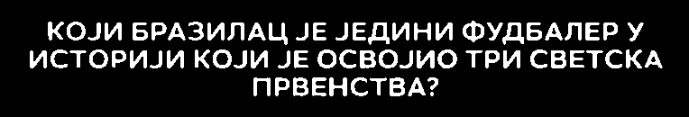
</p>

After tesseract OCR processing, this is the string that we got:

`кОЈИ БРАЗИЛАЦ ЈЕ ЈЕДИНИ ФУДБАЛЕР  У

ИСТОРИЈИ КОЈИ ЈЕ ОСВОЈИО ТРИ СВЕТСКА
ПРВЕНСТВА2

`

As you can see it's pretty good, but it requires sanitization. We can remove new lines (`
`), change all letters to be uppercase, and remove double spaces (empty characters). Also, the last character, the "?" is, it seems, some other font, other than the main text, and because of it, tesseract thinks it's a number "2" :D

If we do the sanitization, we finally get:

`КОЈИ БРАЗИЛАЦ ЈЕ ЈЕДИНИ ФУДБАЛЕР У ИСТОРИЈИ КОЈИ ЈЕ ОСВОЈИО ТРИ СВЕТСКА ПРВЕНСТВА?`

To obtain the answer, the process is pretty straightforward now, but we need to keep in mind that "2" in the answer can be the actual number two. So, for the answer, we should skip "2" -> "?" sanitization.

Answer:

<p align="center">

</p>

OCR: 

`ПЕЛЕ`

## Slagalica crawler example run

Now when you know how everything works, here is a recording of the processing of one of the episodes and the output that we received.

<p align="center">

</p>

```
#1 Question: КОЈИМ ЛАТИНСКИМ ИМЕНОМ НА СЛОВО "С" НАЗИВАМО СРЕДСТВО ЗА СМИРЕЊЕ?

Answer: СЕДАТИВ
```
